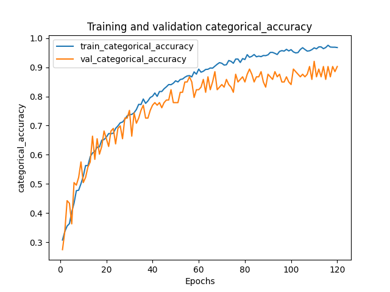

# River Classifier

This is a repository for a simple image classification task.

## Environment
ubuntu 20.04, python 3.8, tensorflow 2.5.0, cuda 11.4, cudnn 8.1

## Preprocessing data

The dataset is in the following format:

```
data/
--testdata/
----*.jpg
--train_data/
----train_image/
------*.jpg
----train_label.csv
```

Our first step is to sort it to a structure that tensorflow loves:

```
python3 preprocess_data.py
```

This will give us data in the following structure:

```
formatted_data/
--0/
----*.jpg
--1/
----*.jpg
...
```

Note, we need to run `python3 identify_bad_images.py` to identify images that are not recognizable for PIL.

## Training

```shell
python3 train.py
```

This takes ~30min on a modern desktop CPU (Ryzen9 5950x) or 4min on a modern desktop GPU (RTX 3090).



We can get ~70% accuracy on validation set -- note, we are almost over-fitting on training set. ~~We should probably consider data augmentation~~.
Update on data augmentation experiments: takes longer to train, accuracy was similar (~70%), however, manual inspection does not show significant improvements.

## Evaluation

Run 

```shell
python3 eval.py
```

to generate `dev/test_data.csv`, which contains the prediction for test data.